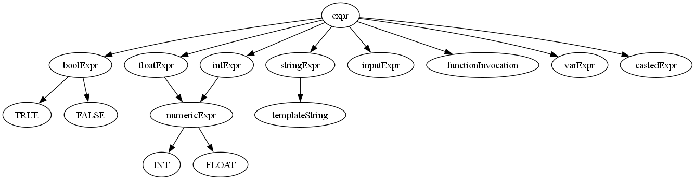

# Scriptorium Interpreter Implementation Report

In this document you can find details on how **Scriptorium** interpreter was created.

**Scriptorium** is a compact, educational programming language designed to demonstrate an end‑to‑end interpreter pipeline built with **ANTLR 4** and a classic tree‑walk evaluator. Its syntax blends Python‑style indentation with Latin keywords (e.g. `scribere` for print, `si … aliter` for if/else).

## Table of Contents

- [Scriptorium Interpreter Implementation Report](#scriptorium-interpreter-implementation-report)
  - [Table of Contents](#table-of-contents)
  - [1. Build \& run](#1-build-run)
  - [2. Execution model (two‑pass)](#2-execution-model-twopass)
  - [3. Variable Management](#3-variable-management)
    - [3.2. Use of `var_map`](#32-use-of-var_map)
      - [3.2.1. List of scope tokens](#321-list-of-scope-tokens)
    - [3.1. Variable classes](#31-variable-classes)
      - [3.1.1. `Var` class](#311-var-class)
      - [3.1.2. `ParamVar` class](#312-paramvar-class)
      - [3.1.3. `FuncVar` class](#313-funcvar-class)
    - [3.3. Storing stack of variable values](#33-storing-stack-of-variable-values)
      - [3.3.1. How it works](#331-how-it-works)
        - [3.3.1.1. Writing](#3311-writing)
        - [3.3.1.2. Reading](#3312-reading)
    - [3.4. Finding variables](#34-finding-variables)
      - [3.4.1. `Var.nearest_scope_variable()` method](#341-varnearest_scope_variable-method)
    - [3.5. Finding scopes](#35-finding-scopes)
      - [3.5.1. `Var.nearest_scope()` method](#351-varnearest_scope-method)
      - [3.5.2. `Var.nth_nearest_scope()` method](#352-varnth_nearest_scope-method)
    - [3.6. Calculating current `recursion_level`](#36-calculating-current-recursion_level)
      - [3.6.1. `Var.nearest_recursion_level()` method](#361-varnearest_recursion_level-method)
  - [4. ANTLR Grammar](#4-antlr-grammar)
    - [4.1. Indents](#41-indents)
    - [4.2. String templating](#42-string-templating)
    - [4.3. Possible value types](#43-possible-value-types)
      - [4.3.1. Diagram of `expr` possible paths](#431-diagram-of-expr-possible-paths)
      - [4.3.2. Type casting](#432-type-casting)
        - [4.3.2.1. Automatic type casting](#4321-automatic-type-casting)
        - [4.3.2.2. Manual type casting](#4322-manual-type-casting)

## 1. Build & run

```bash
# regenerate parser after grammar changes
antlr4 -Dlanguage=Python3 ScriptoriumLexer.g4
antlr4 -Dlanguage=Python3 Scriptorium.g4

# execute a program
python main.py examples/hello.cr7
```

## 2. Execution model (two‑pass)

The interpreter runs in two distinct passes:

1. **Declaration pass** — in this run `var_map` dictionary is populated with variable, parameter, and function signatures. This dictionary helps keep track of all variables in use.

1. **Evaluation pass** — the visitor updates those `var_map` entries with runtime values, enabling forward references and precise scope resolution.

## 3. Variable Management

The most important part of Scriptorium interpreter is a **variable management system**. There is a plenty of methods/classes created to help with process of defining, writing and reading variables or function invocation.

### 3.2. Use of `var_map`

To keep track of every variable in Scriptorium we use a dictionary. We have a list of tokens that we define as **"scope tokens"** (list of tokens below). Those tokens are keys in `var_map` dictionary. Then there is another dictionary where keys are variable names and values are `Var` objects.

Structure of `var_map`:

```python
var_map: Dict[ctx, Dict[str, Var]]
```

*\* Where `ctx` is a type of node context object*

**Example:**  

```scriptorium
numerus a esto 5.
nihil munus func(numerus x):
    scribere x.
```

would result with `var_map` looking like this:

```python
{
  <Scriptorium.ScriptoriumParser.ScriptoriumParser.StartContext object at 0x000001B37D4337B0>: {
    'a': <Var: typeId=23, value=[]>, 
    'func': <FuncVar: typeId=5, value=[], returnType=29>
  }, 
  <Scriptorium.ScriptoriumParser.ScriptoriumParser.FunctionDeclarationContext object at 0x000001B37D6C3900>: {
    'x': <ParamVar: typeId=23, value=[]>
  }
}
```

#### 3.2.1. List of scope tokens

* `IfBlockContext` - If block scope
* `IfElseBlockContext` - If else block scope
* `ElseBlockContext` - Else block scope
* `ForLoopContext` - For loop scope
* `WhileLoopContext` - While loop scope
* `FunctionDeclarationContext` - Function scope
* `StartContext` - Global scope

### 3.1. Variable classes

To manage scopes, variable types and all metadata of variable system there are following classes implemented:

<p align="center">
  
</p>

#### 3.1.1. `Var` class

This is a default variable class. It's used when declaring new variable in any scope and for iterator variable in `for` loop.

#### 3.1.2. `ParamVar` class

This is a variable class used for function parameters. It's used to distinguish variables defined inside function from function parameters.

#### 3.1.3. `FuncVar` class

In Scriptorium function is also a variable. It has additional fields:

* `return_type` - Type of value returned from the function
* `function_ctx` - Context of function node. Used for function invocation.
* `recursion_level` - Used to determine which value to get from value stacks of other variables inside function scope (for recursion).

### 3.3. Storing stack of variable values

Every variable in Scriptorium has it's own stack. We obtain a value from the stack based on recursion level:

```python
current_value = some_var.value[recursion_level]
```

#### 3.3.1. How it works

##### 3.3.1.1. Writing

When writing new value to the stack there are only two options

1. There is a value for specified `recursion_level`:

    Value gets overwritten

    ```python
    recursion_level = 2
    # var.value -> [0, 1, 2]
    var.change_or_append_value(recursion_level, 10)
    # var.value -> [0, 1, 10]
    ```

2. There is no value for specified `recursion_level`:

    Value is appended at specified `index = recursion_level`. Values at `indices < recursion_level` are set to `None`

    ```python
    recursion_level = 2
    # var.value -> [15]
    var.change_or_append_value(recursion_level, 20)
    # var.value -> [15, None, 10]
    ```

##### 3.3.1.2. Reading

If given `Var` value stack is shorter than `recursion_level` or value on given index is `None`, then there is exception raised:

`CULPA: linea xx:yy - variable named "a" is not yet defined`

### 3.4. Finding variables

When we need to read value of a variable we use a `Var.nearest_scope_variable()` static method. It searches through `var_map` until it finds a variable with specified name or raise an error when there is no variable with that name.

#### 3.4.1. `Var.nearest_scope_variable()` method

This method finds nearest variable with specified name. 

```py
def nearest_scope_variable(ctx, var_map, return_parent_ctx=False, name="", scope=0):
  """
  Searches for the nearest variable definition in the current or parent scopes.

  Args:
      ctx: The current context object, typically representing a scope or block.
      var_map (dict): A mapping of contexts to their defined variables. 
                      Each key is a context, and each value is a dictionary of variable names to their Var objects.
      return_parent_ctx (bool, optional): If True, returns a tuple containing the variable value and its parent context.
                                          Defaults to False.
      name (str, optional): The name of the variable to search for. If empty, the variable name is extracted from `ctx`.
                            Defaults to an empty string.
      scope (int, optional): The number of scopes to go back for the search. Used for error reporting purposes.
                              Defaults to 0.

  Returns:
      The Var object of the nearest variable matching the name in the current or parent scopes.
      If `return_parent_ctx` is True, returns a tuple (variable_object, parent_context).

  Raises:
      Exception: If the variable is not found in the current or parent scopes, an exception is raised with details
                  about the line and column of the context and the scope depth.
  """
```


**Why is parent context useful?** Because when searching for function recursion level you can start searching from variable parent context to avoid getting wrong recursion level value.

### 3.5. Finding scopes

When searching for scopes we look for [**"scope tokens"**](#121-list-of-scope-tokens). There are 2 methods that help us manage scopes throughout development process.

#### 3.5.1. `Var.nearest_scope()` method

Function that returns a context of nearest **"scope token"**.

```py
def nearest_scope(ctx):
  """
  Determines the nearest enclosing scope for a given context.
  This function traverses the parent contexts of the given `ctx` object
  until it finds a context that matches one of the predefined scope types.
  If no matching scope is found, it returns the topmost parent context.
  Args:
      ctx: The current context object.
  Returns:
      The nearest enclosing scope context object that matches one of the
      predefined scope types.
  """
```

#### 3.5.2. `Var.nth_nearest_scope()` method

Function used with `parentes` keyword. It helps wind variables above certain number of scopes.

```py
def nth_nearest_scope(ctx, n):
  """
  Retrieves the nth nearest scope from the given context.

  This function navigates up the scope hierarchy starting from the provided
  context (`ctx`) to find the nth nearest scope. If the requested scope level
  exceeds the available parent scopes, an exception is raised.

  Args:
      ctx: The current context object.
      n (int): The number of scopes to move up from the current context.

  Returns:
      The context object representing the nth nearest scope.

  Raises:
      Exception: If the requested scope level exceeds the available parent
                  scopes, an exception is raised.
  """
```

### 3.6. Calculating current `recursion_level`

When function is invoked, then a `recursion_level` attribute on `FuncVar` object that holds function context is incremented. When function returns - attribute is decremented. While trying to access any variable we use `Var.nearest_recursion_level()` static method to search for closest function scope (or start scope for global variables) and get it's `recursion_level` value.

\* `recursion_level` is calculated from node which is a context parent for specified variable inside `var_map` (or from the closest parent with a function or start context)

#### 3.6.1. `Var.nearest_recursion_level()` method

```py
def nearest_recursion_level(ctx, var_map):
  """
  Determines the recursion level of the nearest function declaration context.

  This function moves up through the parent contexts of the given `ctx` to locate the nearest
  function declaration context. Once found, it retrieves the recursion level of the
  corresponding function variable from the `var_map`.

  Args:
      ctx: The current context object, typically an instance of a parser context.
      var_map: A dictionary mapping scope contexts to variable mappings. Each variable
            mapping contains function variables with their associated recursion levels.var_map (dict): A mapping of contexts to their defined variables. 
                Each key is a context, and each value is a dictionary of variable names to their Var objects.

  Returns:
      int: The recursion level of the nearest function declaration context. If no function
        declaration context is found, returns 0.
  """
```

## 4. ANTLR Grammar

### 4.1. Indents

For indentation mechanic we used a Antlr **addon**: `antlr-denter` [[LINK]](https://github.com/yshavit/antlr-denter).  
We followed instructions and implemented it in our language. It helps us keep track of indentation level and check if it is correct. Antlr rules that use indentation looks like this:

```antlr
block: INDENT statement+ DEDENT
```

### 4.2. String templating

For string templating we used Antler lexer **modes**. There are 3 modes:

1. `DEFAULT`
2. `IN_STRING` - anything between `"` characters
3. `IN_INTERP` - while in `IN_STRING` mode, anything between `${` and `}`

**Modes** are only used for string templating because we decided to use them at the and of the project when all the rest was done. Using modes earlier would probably be a good idea.

### 4.3. Possible value types

Every value that exists in Scriptorium is a **expr**. There are many possible operations depending on type of variables and/or constants. 

Expr can be one of: 

1. Standard types:

   * `veritas` - Bool
   * `fractio` - Float
   * `numerus` - Int
   * `sententia` - String

2. Value of other operations:

   * `rogare` - User input
   * `ut` - Casting result
   * Function invocation result
   * Other variable assignment

#### 4.3.1. Diagram of `expr` possible paths



#### 4.3.2. Type casting

##### 4.3.2.1. Automatic type casting

There are few moments when `expr` value is automatically casted to the right type. Those scenarios are:

1. **Variable definition**

    Based on metadata stored in `Var.type_id`

2. **Function invocation**

    Based on metadata stored in `ParamVar.type_id`

3. **Returning from function**

    Based on metadata stored in `FuncVar.return_type`

*\* There is also a **numericExpr** - merge of floatExpr and intExpr, that allows user to make operations on both integers and float numbers without casting.*

##### 4.3.2.2. Manual type casting

In other scenarios where there is no metadata found on what is the target type of value. For manual casting there is a `ut` keyword.

```scriptorium
scribere 2 adde "2" ut numerus. // Result: "4.0"
scribere 2 adde "2". // CULPA: linea 2:19 - syntax error at "2".
```